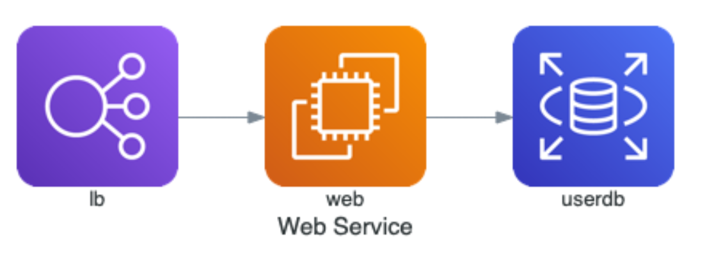

# Python

## 🕸Web Frameworks

## 📟GUI

## 🖥CLI

## 📅Data Science

## ⓂMachine Learning

## 👉 **BOT**

## **⭕Others**

#### _**1. Visualize python code using Python Tutor**_



```python
namesList = ["Hello", "World!", "Nice", "Work", "Python", "Tutor"]

for value in namesList:
    print(f'{value}')
```







[http://pythontutor.com/visualize.html\#code=namesList%20%3D%20%5B%22Hello%22,%20%22World!%22,%20%22Nice%22,%20%22Work%22,%20%22Python%22,%20%22Tutor%22%5D%0A%0Afor%20value%20in%20namesList%3A%0A%20%20%20%20print%28f'%7Bvalue%7D'%29&cumulative=false&curInstr=13&heapPrimitives=nevernest&mode=display&origin=opt-frontend.js&py=3&rawInputLstJSON=%5B%5D&textReferences=false](http://pythontutor.com/visualize.html#code=namesList%20%3D%20%5B%22Hello%22,%20%22World!%22,%20%22Nice%22,%20%22Work%22,%20%22Python%22,%20%22Tutor%22%5D%0A%0Afor%20value%20in%20namesList%3A%0A%20%20%20%20print%28f'%7Bvalue%7D'%29&cumulative=false&curInstr=13&heapPrimitives=nevernest&mode=display&origin=opt-frontend.js&py=3&rawInputLstJSON=%5B%5D&textReferences=false)



#### _2. Diagrams as code_



```python
from diagrams import Diagram
from diagrams.aws.compute import EC2
from diagrams.aws.database import RDS
from diagrams.aws.network import ELB

with Diagram("Web Service", show=False):
    ELB("lb") >> EC2("web") >> RDS("userdb")
```



1. _**pip install diagrams**_

    _**2.**_ [_**https://stackoverflow.com/questions/35064304/runtimeerror-make-sure-the-graphviz-executables-are-on-your-systems-path-aft**_](https://stackoverflow.com/questions/35064304/runtimeerror-make-sure-the-graphviz-executables-are-on-your-systems-path-aft) _**for graphviz installation and settings.**_







\*\*\*\*

