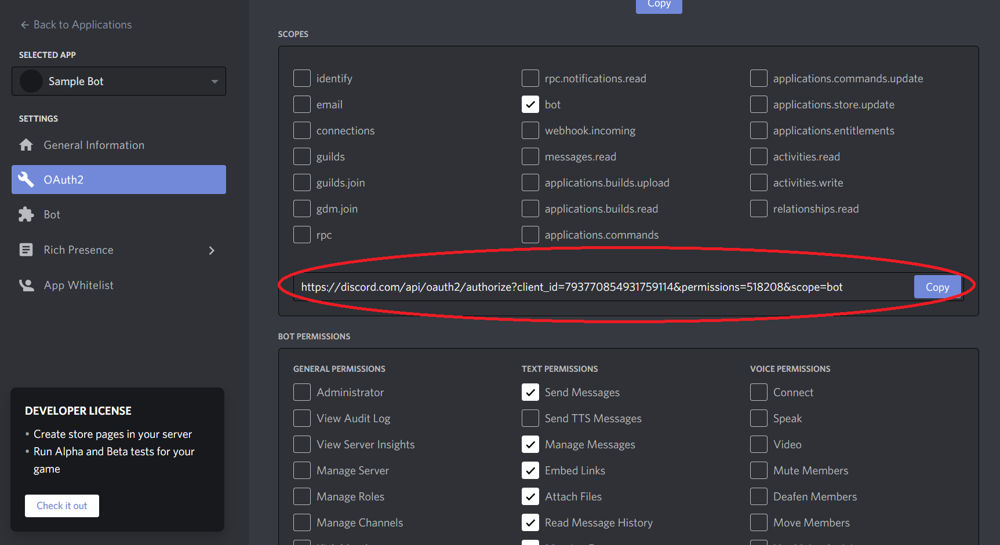

# Discord Bot Python\(🐍\) & Hosting on Cloud \(☁\)

## **Prerequisites**



1. [**Discord**](http://www.discord.com/)\*\*\*\*
2. [**Repl.it**](https://repl.it/) ****
3. [**Uptime**](https://uptimerobot.com/)\*\*\*\*



1. **Discord -** pip install discord
2. **Flask -** pip install Flask
3. **Env -** pip install python-dotenv



## 💻Repl.it \(Development & WebServer\)

Open Repl.it, Create a folder\(discordApp\) and Create the files main.py, webserver.py, requirements.txt and .env files copy the code below into main.py, Webserver.py,.env and requirements.txt as shown below. Run the **main.py** file and copy the repl.it url **\(**[**https://xxx.repl.co**](https://botpy.application2020.repl.co)**\).**




```python
# Import the required packages
import discord
from discord.ext import commands
from webserver import keep_alive
import os

client = discord.Client()

@client.event
async def on_ready():
  print("👍 Bot is up now!")

@client.event
async def on_message(message):
  if message.content.startswith('$hello'):
    await message.channel.send('👋Hello!')
  
  if message.content.startswith('$about'):
    embedVar = discord.Embed(title="Bot🤖", description="This bot helps to support on latest technologies", color=0x0099ff)
    await message.channel.send(embed=embedVar)

  if message.content.startswith('$how are you?'):
    await message.channel.send('Iam super👌. How are your?')

  if message.content.startswith('$Iam fine.'):
    await message.channel.send('Ok. How may i help you?')

  if message.content.startswith('$What is your name?'):
    await message.channel.send('My name is chitti the Robot!🤖')

  if message.content.startswith('$How you built?'):
    await message.channel.send('Using python🐍 & discord👨‍🎓')

  if message.content.startswith('$version'):
    await message.channel.send('Version 1.0.0')
    
  if message.content.startswith('$bye'):
    await message.channel.send('👋Bye!. See you Soon.')

  if message.content.startswith('$How to learn python?'):
    await message.channel.send('Refer the github repo - https://github.com/mGalarnyk/Python_Tutorials')

# Flask Code which will act as server
keep_alive()

# Robot Token Value
TOKEN = os.environ.get('DISCORD_BOT_TOKEN')

client.run(TOKEN)
```




```python
# Keep running the program though we closed the repl
# using flask - Server program

from flask import Flask
from threading import Thread

app = Flask('')

@app.route('/')
def home():
  return "Hello. I am alive"

def run():
  app.run(host='0.0.0.0', port=8000)

def keep_alive():
  t = Thread(target=run)
  t.start()
```



```text
discord.py
flask
python-dotenv
```



```

```



```text
DISCORD_BOT_TOKEN='Add the bot token value'
```




**How to get BOT TOKEN value?**

Navigate to the url [https://discord.com/developers/applications/](https://discord.com/developers/applications/) and select the bot under the 'SELECTED APP' -&gt; click on Bot and Under Token copy the value.


## 👉Discord \(Bot\)

### Server

Navigate to **"**[**https://discord.com/channels/@me**](https://discord.com/channels/@me)**"** and click on the "Add a Server" button as shown below and select 'Create my own' -&gt; Select 'skip this question' -&gt; Provide the server name & Create the server.







### Bot

1. Navigate to **'**[**https://discord.com/developers/applications**](https://discord.com/developers/applications)**'** and click on **'New Application'.**
2. Name the bot and Click on "Create" Button. Select 'OAuth2' under settings and select bot\(under **Scope**\) and select the permissions as shown below.
3. Copy the 'Bot' URL as specified below, open the browser and copy the url, select the server created in previous step.











## 🤖UptimeRobot \(Monitor the Bot\)

1. Login in to [https://uptimerobot.com/](https://uptimerobot.com/) and click on **'Add New Monitor'.**
2. Copy the url from the repl.it \([**https://xxx.repl.co**](https://botpy.application2020.repl.co)\) and add it in the monitor page as shown below and click on 'Create Monitor' button \(2 times with default settings\).











## Demo







