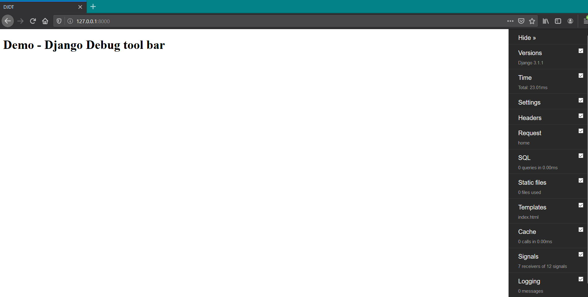

# Django - Debug Toolbar Setup

**Prerequisites**

* Python 3+ already installed.
* Virtual Environment installed - **pip install virtualenv**
* Django installed - pip install django
* Django tool bar installed - pip install django-debug-toolbar

**Steps:** 

**1**. Start virtual environment - python -m venv venv 

**2.** Run the command - .\Scripts\activate.bat 

**3.** Create a project \(demo\) - django-admin startproject demo 

**4.** Add the contents in [settings.py](http://settings.py) file as shown below,

* [\*\*Settings.py](http://settings.py) \(inside Demo folder\)\*\*

  ```text
    from pathlib import Path
    import os

    # Build paths inside the project like this: BASE_DIR / 'subdir'.
    BASE_DIR = Path(__file__).resolve().parent.parent

    # Quick-start development settings - unsuitable for production
    # See https://docs.djangoproject.com/en/3.1/howto/deployment/checklist/

    # SECURITY WARNING: keep the secret key used in production secret!
    SECRET_KEY = 'secret'

    # SECURITY WARNING: don't run with debug turned on in production!
    DEBUG = True

    ALLOWED_HOSTS = []

    # Application definition

    INSTALLED_APPS = [
        'django.contrib.admin',
        'django.contrib.auth',
        'django.contrib.contenttypes',
        'django.contrib.sessions',
        'django.contrib.messages',
        'django.contrib.staticfiles',
        'debug_toolbar',
    ]

    MIDDLEWARE = [
        'debug_toolbar.middleware.DebugToolbarMiddleware',
        'django.middleware.security.SecurityMiddleware',
        'django.contrib.sessions.middleware.SessionMiddleware',
        'django.middleware.common.CommonMiddleware',
        'django.middleware.csrf.CsrfViewMiddleware',
        'django.contrib.auth.middleware.AuthenticationMiddleware',
        'django.contrib.messages.middleware.MessageMiddleware',
        'django.middleware.clickjacking.XFrameOptionsMiddleware',
    ]

    ROOT_URLCONF = 'demo.urls'

    TEMPLATES = [
        {
            'BACKEND': 'django.template.backends.django.DjangoTemplates',
            'DIRS': ['templates'],
            'APP_DIRS': True,
            'OPTIONS': {
                'context_processors': [
                    'django.template.context_processors.debug',
                    'django.template.context_processors.request',
                    'django.contrib.auth.context_processors.auth',
                    'django.contrib.messages.context_processors.messages',
                ],
            },
        },
    ]

    WSGI_APPLICATION = 'demo.wsgi.application'

    # Database
    # https://docs.djangoproject.com/en/3.1/ref/settings/#databases

    DATABASES = {
        'default': {
            'ENGINE': 'django.db.backends.sqlite3',
            'NAME': BASE_DIR / 'db.sqlite3',
        }
    }

    # Password validation
    # https://docs.djangoproject.com/en/3.1/ref/settings/#auth-password-validators

    AUTH_PASSWORD_VALIDATORS = [
        {
            'NAME': 'django.contrib.auth.password_validation.UserAttributeSimilarityValidator',
        },
        {
            'NAME': 'django.contrib.auth.password_validation.MinimumLengthValidator',
        },
        {
            'NAME': 'django.contrib.auth.password_validation.CommonPasswordValidator',
        },
        {
            'NAME': 'django.contrib.auth.password_validation.NumericPasswordValidator',
        },
    ]

    # Internationalization
    # https://docs.djangoproject.com/en/3.1/topics/i18n/

    LANGUAGE_CODE = 'en-us'

    TIME_ZONE = 'UTC'

    USE_I18N = True

    USE_L10N = True

    USE_TZ = True

    # Static files (CSS, JavaScript, Images)
    # https://docs.djangoproject.com/en/3.1/howto/static-files/

    STATIC_URL = '/static/'

    STATICFILES_DIRS = [os.path.join(BASE_DIR, 'static_in_env')]

    INTERNAL_IPS = [
        '127.0.0.1'
    ]

    VENV_PATH = os.path.dirname(BASE_DIR)
    STATIC_ROOT = os.path.join(VENV_PATH, 'static_root')
    MEDIA_URL = '/media/'
    MEDIA_ROOT = os.path.join(VENV_PATH, 'media')

    # DEBUG TOOLBAR SETTINGS

    DEBUG_TOOLBAR_PANELS = [
        'debug_toolbar.panels.versions.VersionsPanel',
        'debug_toolbar.panels.timer.TimerPanel',
        'debug_toolbar.panels.settings.SettingsPanel',
        'debug_toolbar.panels.headers.HeadersPanel',
        'debug_toolbar.panels.request.RequestPanel',
        'debug_toolbar.panels.sql.SQLPanel',
        'debug_toolbar.panels.staticfiles.StaticFilesPanel',
        'debug_toolbar.panels.templates.TemplatesPanel',
        'debug_toolbar.panels.cache.CachePanel',
        'debug_toolbar.panels.signals.SignalsPanel',
        'debug_toolbar.panels.logging.LoggingPanel',
        'debug_toolbar.panels.redirects.RedirectsPanel',
        'debug_toolbar.panels.profiling.ProfilingPanel',
    ]

    def show_toolbar(request):
        return True

    DEBUG_TOOLBAR_CONFIG = {
        "INTERCEPT_REDIRECTS": False,
        "SHOW_TOOLBAR_CALLBACK" : show_toolbar
    }

    # This code added to avoid the issue Failed to load module script: The server responded with a non-JavaScript MIME type of "text/plain". Strict MIME type checking is enforced for module scripts per HTML spec in django tool bar
    if DEBUG:
        import mimetypes
        mimetypes.add_type("application/javascript", ".js", True)
  ```

* urls.py**\(inside Demo folder\)**

  ```python
    import debug_toolbar
    from django.conf import settings

    from django.contrib import admin
    from django.urls import path, include

    from .views import home

    urlpatterns = [
        path('__debug__/', include(debug_toolbar.urls)),
        path('admin/', admin.site.urls),
        path('', home, name='home'),    
    ]
  ```

* views.py**\(inside Demo folder\)**

  ```python
    from django.shortcuts import render

    def home(request):
        return render(request, "index.html", {})
  ```

**5.** Create a folder called 'static\_in\_env' \(**inside Demo folder\) and** templates **\(inside Demo folder\)** 

* Templates - base.html & index.html

  ```markup
    <!DOCTYPE html>
    <html>
    <head>
        <meta charset="UTF-8">
        <meta name="viewport" content="width=device-width, initial-scale=1.0">
        <meta http-equiv="X-UA-Compatible" content="ie=edge">
        <title>DJDT</title>
    </head>
    <body>
        
        

    </body>
    </html>
  ```

  ```markup
    

    
        <h1> Demo - Django Debug tool bar </h1>
    
  ```

  Run the below commands,

* python [manage.py](http://manage.py) migrate
* python [manage.py](http://manage.py) createsuperuser
* python [manage.py](http://manage.py) collectstatic \(this command will create folder called **'static\_root'** in **venv folder\).**
* python [manage.py](http://manage.py) runserver

**Final - Output**



* **References**

  * [https://django-debug-toolbar.readthedocs.io/en/latest/installation.html\#](https://django-debug-toolbar.readthedocs.io/en/latest/installation.html#)
  * [https://stackoverflow.com/questions/64013643/failed-to-load-module-script-the-server-responded-with-a-non-javascript-mime-ty](https://stackoverflow.com/questions/64013643/failed-to-load-module-script-the-server-responded-with-a-non-javascript-mime-ty)
  * [https://www.youtube.com/watch?v=GEogao-tUec&list=PLLRM7ROnmA9FgFlqn-HHBz0LJ62qJBwSw](https://www.youtube.com/watch?v=GEogao-tUec&list=PLLRM7ROnmA9FgFlqn-HHBz0LJ62qJBwSw)

* **Git hub Link**

  [https://github.com/SurendraRedd/DjangoProject/tree/master/Projects/DJDT](https://github.com/SurendraRedd/DjangoProject/tree/master/Projects/DJDT)

