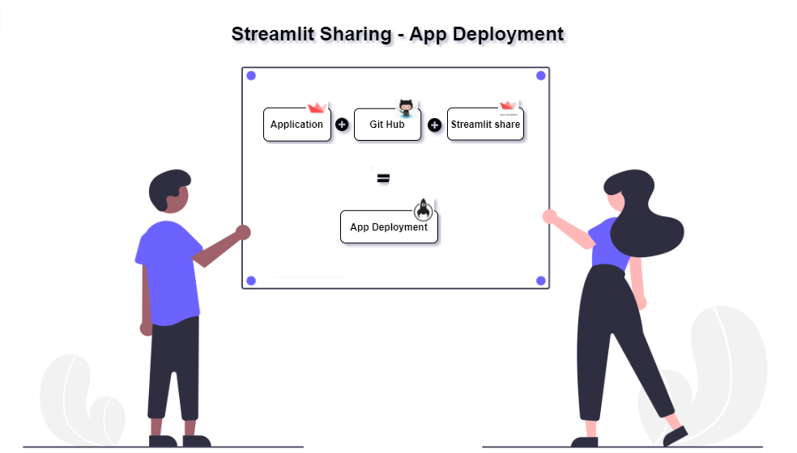
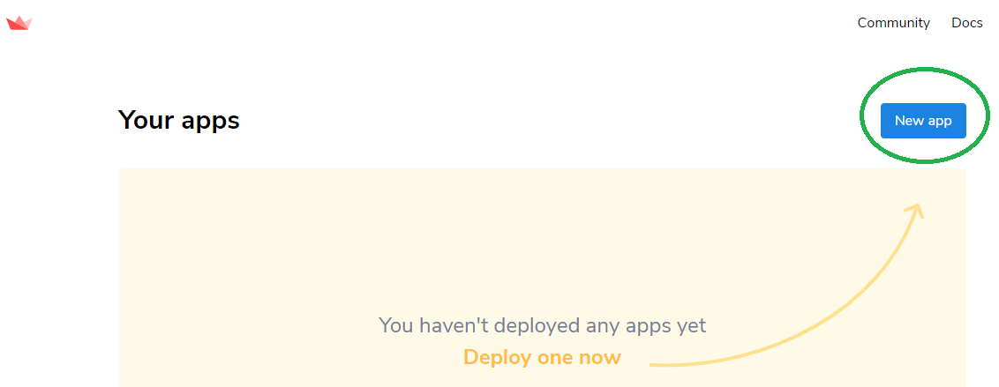
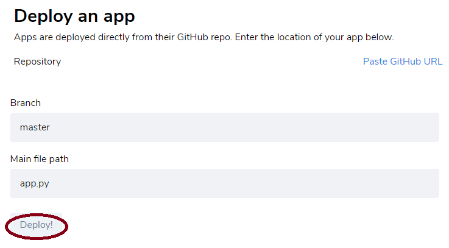
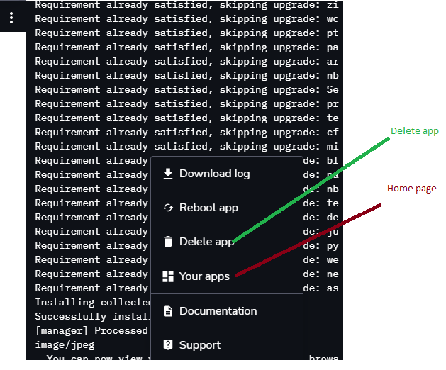

# StreamlitApp Deployment




**Prerequisites**

* Requirements.txt file
* Git hub account
* Access to [share.streamlit.io](http://share.streamlit.io/)

**Detailed Procedure**

1. Run the command **'pip freeze &gt; requirements.txt'** \(Traditional way - Not recommended due to other packages\) 

**Alternate\(Recommended\)** way install the package 

a\) pip install pipreqs 

b\) open the command prompt and run pipreqs 'path of the python file'**Eg:- pipreqs C:\projects\streamlit or 'pipreqs .\'** 

* 2. Commit the [app.py](http://app.py/)\(code\) files in to git hub repository. Refer the sample code for the Applications.


* **Applications**

  * **Convert Image to Pencil Sketch Image code**

    ```python
      # Image to Pencil sketch app
      import streamlit as st
      import numpy as np
      from PIL import Image
      import cv2

      st.set_option('deprecation.showfileUploaderEncoding', False)

      def dodgeV2(x, y):
          return cv2.divide(x, 255 - y, scale=256)

      def pencilsketch(inp_img):
          img_gray = cv2.cvtColor(inp_img, cv2.COLOR_BGR2GRAY)
          img_invert = cv2.bitwise_not(img_gray)
          img_smoothing = cv2.GaussianBlur(img_invert, (21, 21),sigmaX=0, sigmaY=0)
          final_img = dodgeV2(img_gray, img_smoothing)
          return(final_img)

      st.title("PencilSketcher App")
      st.write("This Web App is to help convert your photos to realistic Pencil Sketches")

      file_image = st.sidebar.file_uploader("Upload your Photos", type=['jpeg','jpg','png'])

      if file_image is None:
          st.write("You haven't uploaded any image file")

      else:
          input_img = Image.open(file_image)
          final_sketch = pencilsketch(np.array(input_img))
          st.write("**Input Photo**")
          st.image(input_img, use_column_width=True)
          st.write("**Output Pencil Sketch**")
          st.image(final_sketch, use_column_width=True)
    ```

  * **Simple App Code**

    ```python
      import streamlit as st

      def main():
          st.title('App Deployment')
          st.subheader("Welcome to simple streamlit app")
          st.text("Simple example")
          st.balloons()

      if __name__ == '__main__':    
          main()
    ```

  Login to [https://share.streamlit.io/](https://share.streamlit.io/) and Select the git hub project and file location as shown in the steps below,

* **Steps:**

  * Login to [https://share.streamlit.io/](https://share.streamlit.io/) using git hub credentials and click on **'New app'**


  * Enter the git hub repository, branch and file name \(app.py\) and click on **'Deploy'**

  * Once deployment is successful it will generate the url [\*\*https://share.streamlit.io/githubuser/projectname/application.py](https://share.streamlit.io/surendraredd/mlstreamlitapp/app.py) or [https://share.streamlit.io/](https://share.streamlit.io/)\[user name\]/\[repo name\]\*\*


  * Click on **'vertical dots' or 'manageapp'** to show the details of the application log








* **References**

  [https://docs.streamlit.io/en/stable/deploy\_streamlit\_app.html](https://docs.streamlit.io/en/stable/deploy_streamlit_app.html)


* **GitHub Location**
  * [https://github.com/SurendraRedd/MLStreamlitApp](https://github.com/SurendraRedd/MLStreamlitApp)
  * [https://surendraredd.github.io/MLStreamlitApp/](https://surendraredd.github.io/MLStreamlitApp/)

**Digital Book**

    ****[https://surendraredd.github.io/Books/](https://surendraredd.github.io/Books/)

